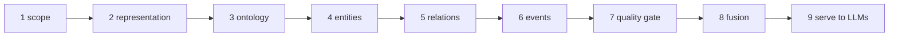

# Graph Engineering

**The discipline of designing the structures AI agents work through — not the prompts.**

It has two halves:

1. **Knowledge graphs** — what agents *remember*. Nodes are entities and facts, edges are
   relationships with time and provenance. Ontology → extraction → fusion → serving.
2. **Task graphs** — how agents *work*. Nodes are jobs, edges are execution dependencies.
   Parallel fan-out, separate verifiers, the stop rule, the human gate.

Prompt engineers steered the model's words. Loop engineers steered its iterations.
Graph engineers steer its **topology**.

This repo turns Southeast University's graduate Knowledge Graph course
([npubird/KnowledgeGraphCourse](https://github.com/npubird/KnowledgeGraphCourse), 4.4K★,
taught in Chinese since 2019) — plus the modern agent-orchestration research behind
task graphs — into things you can actually use today.

## What's inside

| Path | What it is |
|---|---|
| [`graph-engineering/`](graph-engineering/) | **The skill.** Hand it to your agent (Claude Code / any skill-compatible harness) — it learns the full 9-stage knowledge-graph pipeline, the task-graph patterns, and a teaching mode that explains every stage with diagrams drawn from *your* domain. |
| [`graph-engineering/references/`](graph-engineering/references/) | The distilled course: [curriculum map](graph-engineering/references/curriculum.md) (translated, with links to the original Chinese decks), [modeling](graph-engineering/references/modeling.md), [extraction](graph-engineering/references/extraction.md), [fusion + GraphRAG](graph-engineering/references/fusion-and-llm.md), [task graphs](graph-engineering/references/task-graphs.md). |
| [`WORKFLOWS.md`](WORKFLOWS.md) | Nine paste-ready prompt blocks — a `/kg-tutor` that teaches you the whole course interactively, plus eight single-purpose tools (`/kg-scope` → `/kg-rag`) that chain into a full build. |
| [`dist/graph-engineering.skill`](dist/) | The packaged skill file. |

## Install (two commands)

```bash
git clone https://github.com/codejunkie99/graph-engineering.git
cp -r graph-engineering/graph-engineering ~/.claude/skills/
```

Then ask your agent to *build* ("build a knowledge graph from my docs") or to *teach*
("teach me graph engineering") — teaching mode walks the pipeline stage by stage with
worked examples and generated diagrams, using your own project as the running example.

## The 9-stage pipeline



Model the domain **before** extracting. Fuse **before** storing. Verify at every stage.
A knowledge graph is a product with a schema, not a pile of triples.

## The task-graph rules (the other half)

- Delete **fake edges**: an arrow is real only when work flows through it.
- The **diamond**: split → parallel workers → *separate* verifier contexts → one owned merge.
- The **stop rule** (Google DeepMind × MIT, 180 configurations): teams win ~80% on work that
  splits; every team configuration loses on sequential work. The shape of the work decides.
- The **human gate**: your approval sits exactly where a mistake is expensive to undo.

Details: [references/task-graphs.md](graph-engineering/references/task-graphs.md)

## Credits

The knowledge-graph half is an independent English distillation of 东南大学《知识图谱》研究生课程
(Southeast University's graduate Knowledge Graph course), Prof. Peng Wang —
[npubird/KnowledgeGraphCourse](https://github.com/npubird/KnowledgeGraphCourse). All original
lecture PDFs are in Chinese and remain in the original repo; none are redistributed here.
Task-graph material draws on Google DeepMind × MIT's
["Towards a Science of Scaling Agent Systems"](https://research.google/blog/towards-a-science-of-scaling-agent-systems-when-and-why-agent-systems-work/)
and Anthropic's published multi-agent engineering work.

MIT licensed. Built by [@Av1dlive](https://x.com/Av1dlive).
