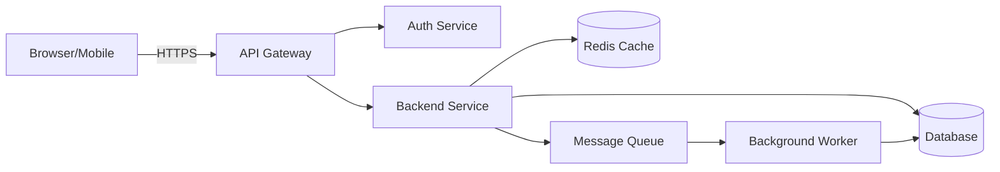

# ARCHITECTURE.md — Template

> Fill every section from the confirmed understanding in Phase 1. Use Mermaid
> fenced blocks for the diagrams. The tech stack and directory structure MUST
> match the actual repo when one exists. Unconfirmed items go in the
> `⚠ Unresolved assumptions` callout.

> ⚠ Unresolved assumptions — only present if confidence < 100%. Else delete.

# System & Technical Architecture

## 1. Tech Stack Overview

| Layer | Technology | Version / Notes |
|---|---|---|
| Language | e.g. TypeScript | ... |
| Frontend framework | e.g. React + Vite | ... |
| Backend framework | e.g. Node/Express or Go/chi | ... |
| Database | e.g. PostgreSQL 16 | ... |
| ORM / query layer | e.g. Prisma | ... |
| Caching | e.g. Redis | ... |
| Message queue | e.g. RabbitMQ / Kafka (or N/A) | ... |
| Third-party services | e.g. Stripe, SendGrid, Auth0 | ... |
| Hosting | e.g. Docker + Fly.io / AWS / Vercel | ... |

## 2. System Architecture Diagram



Add a note under the diagram describing data flow: request lifecycle, where
caching happens, where async work is handed off.

## 3. Directory & Project Structure

```
├── src/
│   ├── api/          # HTTP handlers / routes
│   ├── core/         # domain logic, business rules
│   ├── db/           # schema, migrations, seeders
│   ├── services/     # external service clients
│   └── web/          # frontend application
├── tests/
├── infra/            # docker, ci, deployment manifests
└── context/          # this specification set
```

Annotate each major folder with one line describing its responsibility.

## 4. Authentication & Authorization Flow

- **Auth scheme**: e.g. JWT access (15 min) + refresh token (7 days), or
  OAuth2, or session cookie.
- **Flow**: login request → credential verify → token issue → client sends
  `Authorization: Bearer <jwt>` → middleware verifies signature/expiry →
  route-level RBAC check.
- **RBAC matrix**: role → permitted route/resource. Link to PRD roles.
- **Transport security**: HTTPS only, HSTS; token storage guidance (httpOnly
  cookie vs in-memory).

## 5. Deployment & Infrastructure

- Hosting strategy: containers? serverless? managed PaaS?
- CI/CD pipeline steps: lint → test → build → push image → migrate DB →
  deploy (green/blue or rolling) → smoke test.
- Environments: dev / staging / production, and differences between them.
- Config & secrets: env vars, secret manager reference.

## 6. Scalability & High Availability Strategy

- Stateless application servers → horizontal scaling.
- Caching: Redis at which layer (session, query cache, rate limit).
- Database: connection pooling (e.g. PgBouncer), read replicas (when/if),
  automated backups + point-in-time recovery, RPO/RTO targets.
- Load balancing: reverse proxy / LB in front of app replicas.
- Failure handling: retries with backoff, circuit breaker, graceful shutdown.