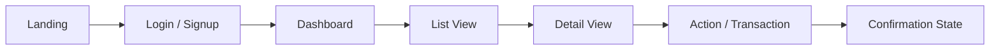

# DESIGN.md — Template

> Fill every section from the confirmed understanding in Phase 1 (product,
> architecture) plus the defaults listed below. If the user did not specify
> visual details, apply these defaults and note them: Primary #2563EB,
> Secondary #64748B, Background #FFFFFF, Error #DC2626; font Inter;
> radius 8px; spacing scale 4/8/12/16/24/32. Unconfirmed items go in the
> `⚠ Unresolved assumptions` callout.

> ⚠ Unresolved assumptions — only present if confidence < 100%. Else delete.

# Design System & UI/UX Architecture

## 1. Design System & Style Guide

### Color Palette

| Token | Value | Usage |
|---|---|---|
| Primary | #2563EB | main actions, active nav |
| Secondary | #64748B | secondary buttons, badges |
| Background | #FFFFFF | page background |
| Surface | #F8FAFC | cards, panels |
| Text | #0F172A | body copy |
| Error | #DC2626 | validation, destructive actions |
| Success | #16A34A | confirmations |
| Warning | #D97706 | caution states |

### Typography

| Token | Value | Usage |
|---|---|---|
| Font family | Inter | UI + body |
| Mono font | JetBrains Mono | code, IDs |
| Display | 600 / 30px | page titles |
| Heading | 600 / 20px | section titles |
| Body | 400 / 14-16px | paragraphs |
| Caption | 400 / 12px | helper text |

### Spacing & Layout

- Spacing scale: 4 / 8 / 12 / 16 / 24 / 32 / 48 px.
- Grid: 12-column, 24px gutters, max content width 1200px.
- Border radius: 8px (default), 999px (pills, avatars).
- Shadows: subtle `0 1px 3px rgba(0,0,0,.08)` for cards; raise on hover.

## 2. Component Hierarchy & Reusability

```
└── App
    ├── Layout
    │   ├── Navbar
    │   ├── Sidebar
    │   └── PageContainer
    ├── ui/              # primitives — buttons, inputs, modal, card, badge
    ├── features/        # feature-specific composites
    └── pages/           # route-level compositions
```

| Component | Variants | Usage notes |
|---|---|---|
| Button | primary / secondary / ghost / danger; sm / md / lg | ... |
| Input | text / password / number / select / textarea | label + error slot |
| Modal | confirm / form / full-screen | focus trap, esc to close |
| Card | default / clickable | ... |
| EmptyState | icon / title / action | used for zero data |

Naming: components are PascalCase, files match component names, CSS
variables for every design token (no hardcoded hex in components).

## 3. User Flow & Page Layouts



For each major page: route, purpose, key components, primary call-to-action.

## 4. UI State Management

Each async surface must handle all four states:

| State | Visual |
|---|---|
| Loading | skeleton screens / spinner + disabled CTA |
| Error | inline error banner + retry action |
| Empty | EmptyState component with next-step CTA |
| Success | confirmation toast / inline success + next action |

Global state: which library (Zustand / Redux / Context / React Query) and what
lives in it (session, preferences, server cache) vs server state.

## 5. Responsiveness & Accessibility

### Breakpoints

| Breakpoint | Range | Layout behavior |
|---|---|---|
| Mobile | < 640px | single column, hamburger nav |
| Tablet | 640-1024px | 2-col grid, sidebar collapses |
| Desktop | > 1024px | full layout, 12-col grid |

### Accessibility (WCAG 2.1 AA)

- Contrast ≥ 4.5:1 for body text.
- All interactive elements keyboard-reachable with visible focus ring.
- Forms: associated `<label>`, error messages linked via `aria-describedby`.
- Modal: focus trap + `aria-modal`.
- Images: meaningful `alt` text; decorative images `alt=""`.
- Target size ≥ 44px on touch devices.