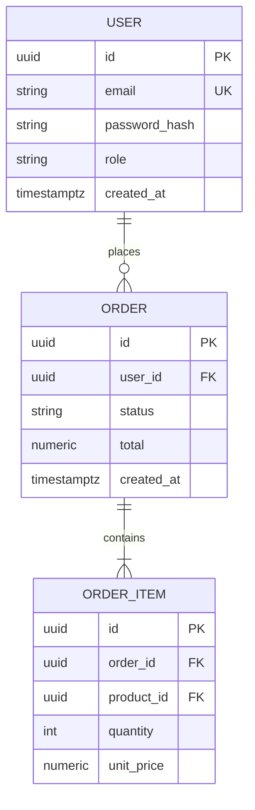

# SCHEMA.md — Template

> Fill every section from the confirmed understanding in Phase 1. Types MUST
> match the database actually chosen (PostgreSQL → UUID/VARCHAR/TIMESTAMPTZ;
> MongoDB → collections + BSON types; SQLite → TEXT/INTEGER). ERD uses
> Mermaid `erDiagram`. Unconfirmed items go in the `⚠ Unresolved assumptions`
> callout.

> ⚠ Unresolved assumptions — only present if confidence < 100%. Else delete.

# Database Schema & Data Models

## 1. Database Overview

| Aspect | Decision |
|---|---|
| Database | e.g. PostgreSQL 16 (relational) |
| ORM / query layer | e.g. Prisma / Drizzle / TypeORM / Mongoose |
| Migrations | e.g. Prisma migrate / drizzle-kit / custom SQL |
| Storage of files | e.g. S3 (DB stores keys only) |

## 2. Entity Relationship Diagram (ERD)

Cardinality legend: One-to-One `||--||`, One-to-Many `||--o{`, Many-to-Many
`}o--o{` with a join table.

## 3. Table / Collection Definitions

### Table: `users`

| Field | Type | Constraints | Default / Notes |
|---|---|---|---|
| id | UUID | PK | `gen_random_uuid()` |
| email | VARCHAR(255) | UNIQUE, NOT NULL | lowercase, indexed |
| password_hash | VARCHAR(255) | NOT NULL | bcrypt/argon2 |
| role | VARCHAR(32) | NOT NULL | `'user'`, enum: user/admin/guest |
| created_at | TIMESTAMPTZ | NOT NULL | `now()` |
| updated_at | TIMESTAMPTZ | NOT NULL | `now()` |

### Table: `orders`
(...repeat table format for every table/collection...)

Conventions:
- Surrogate `id` PK for every table.
- `created_at` / `updated_at` on every table.
- Foreign keys named `<singular>_id`.
- Soft delete via `deleted_at` only where explicitly required.

## 4. Indexing & Performance Rules

| Table | Index | Type | Rationale |
|---|---|---|---|
| users | email | UNIQUE B-tree | login lookup |
| orders | (user_id, created_at) | B-tree composite | user order history |
| order_items | order_id | B-tree | join performance |

Rules:
- Index every FK. Index columns used in `WHERE`/`ORDER BY` with real
  cardinality; do not index low-selectivity columns (e.g. booleans).
- Use `EXPLAIN ANALYZE` on hot queries before adding indexes.
- Pagination via keyset (`WHERE id > $1 ORDER BY id LIMIT 50`) for large
  tables, not `OFFSET`.
- Avoid `SELECT *` in application queries; list columns explicitly.
- Prefer partial indexes for filtered subsets (`WHERE status = 'active'`).